# Traceroute

## Analiza rutelor:
### Locatiile testate:
- Reteaua de acasa;
- Retea public (de la o cafenea);
### Site-urile testate:
- google.com (America);
- m.airchina.com.cn (China);
- ugg.com.au (Australia);
- axxess.co.za (Africa);

## Vizualizare rute si locatii (oras, regiune, tara):
### 1. Am afisat ruta de la IP-ul 172.20.10.1 (de la cafeneaua din centrul vechi LVEV) catre IP-ul 8.8.8.8 (America):
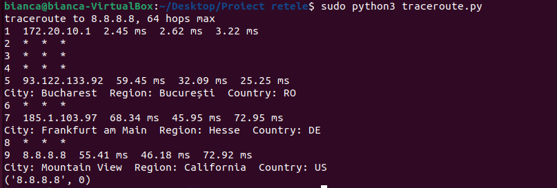
### 2. Am afisat ruta de la IP-ul 172.20.10.1 (de la cafeneaua din centrul vechi LVEV) catre domain-name-ul google.com (America):
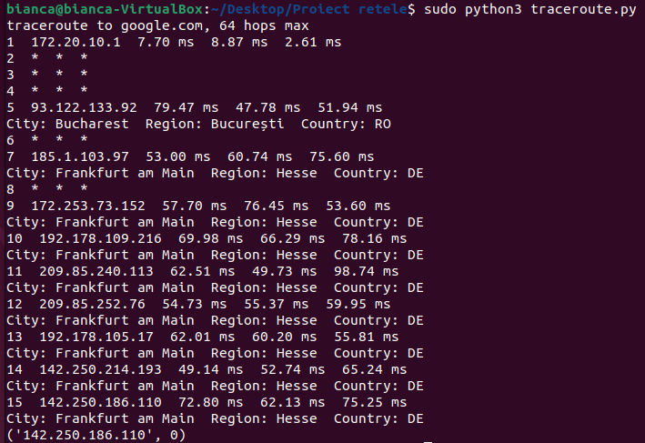
### 3. Am afisat ruta de la IP-ul 172.20.10.1 (de la cafeneaua din centrul vechi LVEV) catre IP-ul 23.227.38.70 (Australia):
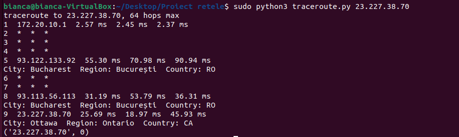
### 4. Am afisat ruta de la IP-ul 172.20.10.1 (de la cafeneaua din centrul vechi LVEV) catre domain-name-ul ugg.com.au (Australia):
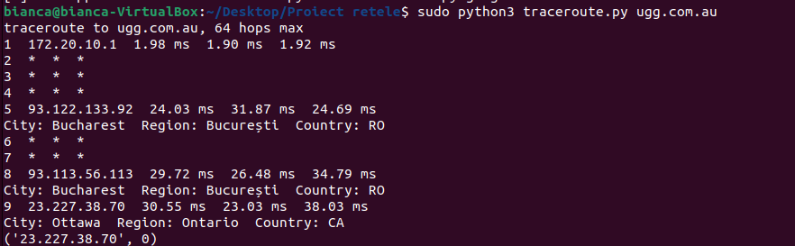
### 5. Am afisat ruta de la IP-ul 172.20.10.1 (de la cafeneaua din centrul vechi LVEV) catre IP-ul 138.113.148.29 (China):
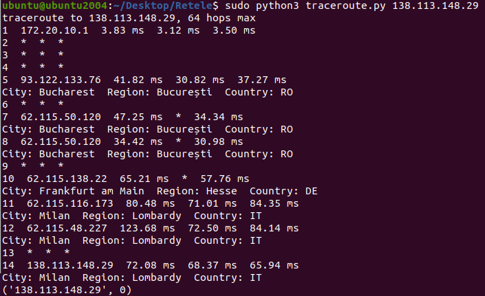
### 6. Am afisat ruta de la IP-ul 172.20.10.1 (de la cafeneaua din centrul vechi LVEV) catre domain-name-ul m.airchina.com.cn (China):
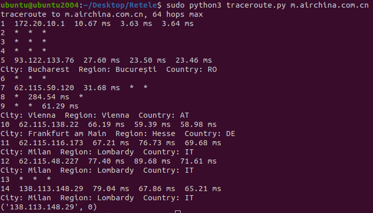
### 7. Am afisat ruta de la IP-ul 172.20.10.1 (de la cafeneaua din centrul vechi LVEV) catre IP-ul 172.66.40.132 (Africa):
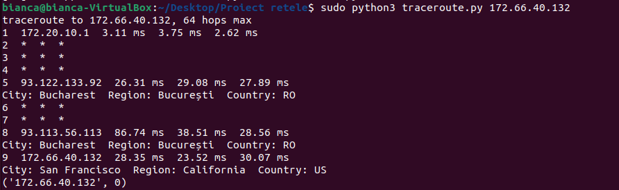
### 8. Am afisat ruta de la IP-ul 172.20.10.1 (de la cafeneaua din centrul vechi LVEV) catre domain-name-ul axxess.co.za (Africa):
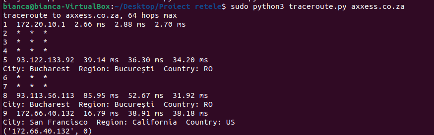

## Demo Harta:
### Am afisat ruta catre domain-name-ul m.airchina.com.cn (China):
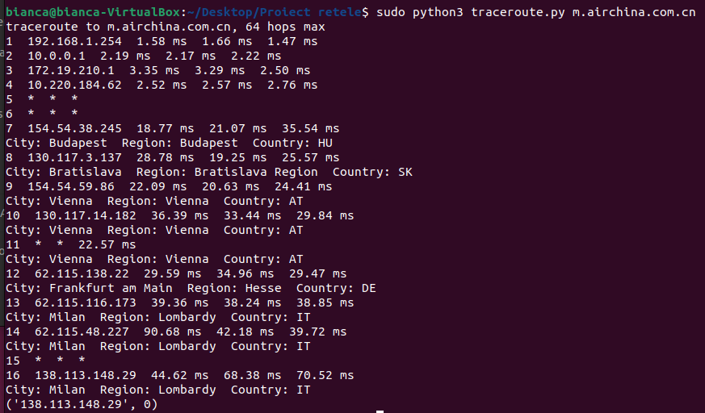
### Am salvat ruta obtinuta intr-un fisier .txt:
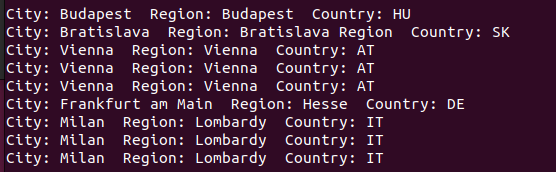
### Harta:
https://github.com/curs-retele-2024/proiect-retele-2024-ping-bing/assets/118912868/b11da24b-90b0-4fd3-b66e-a0614bdf1bfd

## Fisierul .txt cu log-ul locatiilor corespunzatoare rutei fiecarui traceroute:
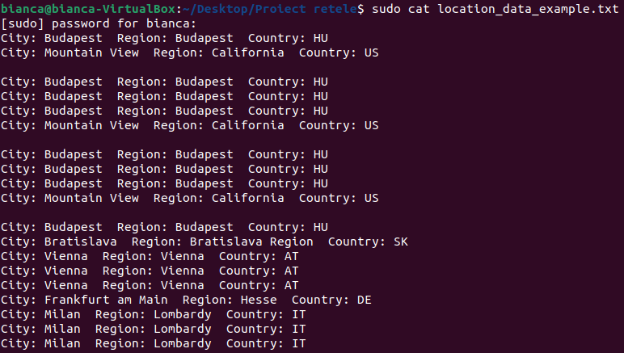
